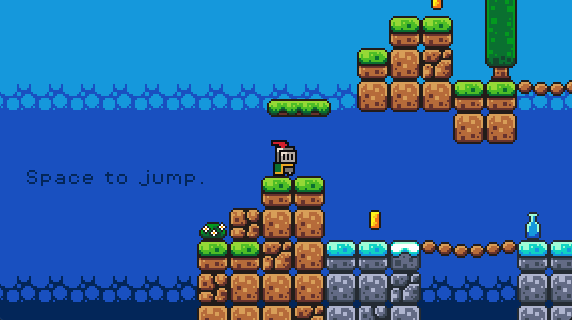
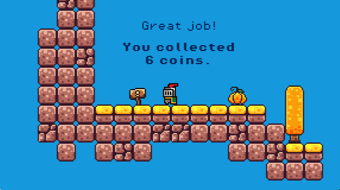
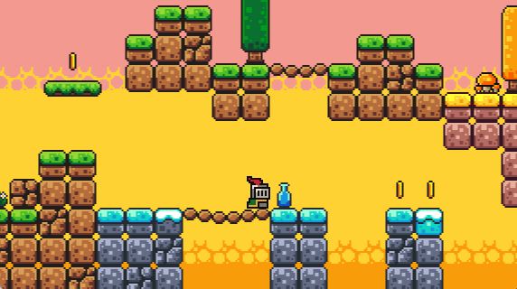
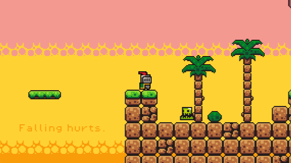

# Platform Game 2D Demo

Based on [How to make a Video Game - Godot Beginner Tutorial](https://www.youtube.com/watch?v=LOhfqjmasi0&ab_channel=Brackeys), expanded some features.

## Controls

* use Space to jump (support double jump)
* use A/Left and D/Right to control the direction
* use R to restart game
* use Esc to quit game

## Screenshots

