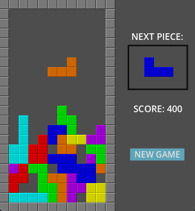
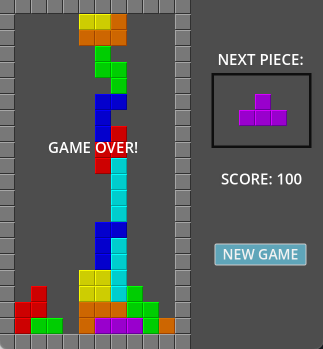

# tetris demo

Based on [Beginner Godot Tutorial - How to Make Tetris](https://www.youtube.com/watch?v=2T2Fkzwf6FM&ab_channel=CodingWithRuss), and fix some bugs.

## Controls

* use ASD to move the piece
* use W to rotate the piece

## Screenshots

